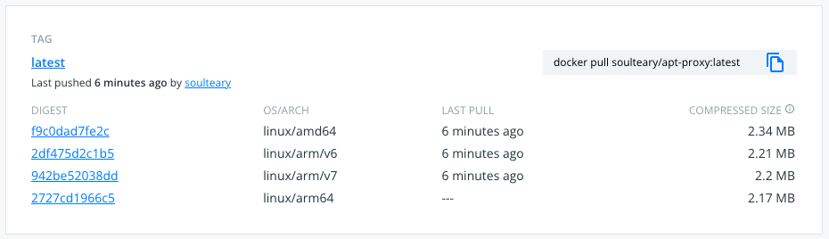

# APT Proxy

[](https://github.com/soulteary/apt-proxy/actions/workflows/scan.yml) [](https://github.com/soulteary/apt-proxy/actions/workflows/release.yaml)


> Lightweight **APT CHACHE PROXY** with only 2MB+ size!



APT Proxy is a Lightweight and Reliable APT packages (Ubuntu / Debian) cache tool, supports a large number of common system and Docker usage.

You can safely use it instead of [apt-cacher-ng](https://www.unix-ag.uni-kl.de/~bloch/acng/).

## Supported Systems and Architectures

- Linux: x86_64 / x86_32
- ARM: ARM64v8 / ARM32v6 / ARM32v7
- macOS: x86_64 / M1 ARM64v8

## Usage

Just run it:

```bash
./apt-proxy

2022/06/12 16:15:40 running apt-proxy
2022/06/12 16:15:41 Start benchmarking mirrors
2022/06/12 16:15:41 Finished benchmarking mirrors
2022/06/12 16:15:41 using fastest mirror https://mirrors.company.ltd/ubuntu/
2022/06/12 16:15:41 proxy listening on 0.0.0.0:3142
```

An APT proxy software with a cache function is started.

Then rewrite the command where you need to execute the `apt-get` command and execute it:

```bash
# `apt-get update` with apt-proxy service
http_proxy=http://your-domain-or-ip-address:3142 apt-get -o pkgProblemResolver=true -o Acquire::http=true update 
# `apt-get install vim -y` with apt-proxy service
http_proxy=http://your-domain-or-ip-address:3142 apt-get -o pkgProblemResolver=true -o Acquire::http=true install vim -y
```

When we need to execute the above commands repeatedly in batches, the speed of update and installation **will be greatly improved**.

### Specified Mirror

```bash
# proxy cache for both `ubuntu` and `debian`
./apt-proxy --ubuntu=https://mirrors.tuna.tsinghua.edu.cn/ubuntu/ --debian=https://mirrors.tuna.tsinghua.edu.cn/debian/
# proxy cache for `ubuntu` only
./apt-proxy --mode=ubuntu --ubuntu=https://mirrors.tuna.tsinghua.edu.cn/ubuntu/
# proxy cache for `debian` only
./apt-proxy --mode=debian --debian=https://mirrors.tuna.tsinghua.edu.cn/debian/
```

### Speed UP Docker Container

Assuming you have started a container:

```bash
# Ubuntu
docker run --rm -it ubuntu
# or Debian
docker run --rm -it debian
```

And your Apt-Proxy is started on host machine, you can speed up the installation with the following command:

```bash
http_proxy=http://host.docker.internal:3142 apt-get -o Debug::pkgProblemResolver=true -o Debug::Acquire::http=true update && \
http_proxy=http://host.docker.internal:3142 apt-get -o Debug::pkgProblemResolver=true -o Debug::Acquire::http=true install vim -y
```

## Docker

Just one command:

```bash
docker run -d --name=apt-proxy -p 3142:3142 soulteary/apt-proxy
```

## Options

View configuration items:

```bash
./apt-proxy -h

Usage of apt-proxy:
  -cachedir string
    	the dir to store cache data in (default "./.aptcache")
  -debian string
    	the debian mirror for fetching packages
  -debug
    	whether to output debugging logging
  -host string
    	the host to bind to (default "0.0.0.0")
  -mode all
    	select the mode of system to cache: all / `ubuntu` / `debian` (default "all")
  -port string
    	the port to bind to (default "3142")
  -ubuntu string
    	the ubuntu mirror for fetching packages
```

## [WIP] Development

Start the application in development mode:

```bash
go run apt-proxy.go
```

### Run Test And Get Coverage

```bash
# go test -cover ./...

?   	github.com/soulteary/apt-proxy	[no test files]
ok  	github.com/soulteary/apt-proxy/cli	0.852s	coverage: 73.9% of statements
ok  	github.com/soulteary/apt-proxy/linux	7.465s	coverage: 82.7% of statements
ok  	github.com/soulteary/apt-proxy/pkgs/httpcache	(cached)	coverage: 82.7% of statements
?   	github.com/soulteary/apt-proxy/pkgs/httplog	[no test files]
ok  	github.com/soulteary/apt-proxy/pkgs/stream.v1	(cached)	coverage: 100.0% of statements
ok  	github.com/soulteary/apt-proxy/pkgs/vfs	(cached)	coverage: 59.3% of statements
?   	github.com/soulteary/apt-proxy/proxy	[no test files]
?   	github.com/soulteary/apt-proxy/state	[no test files]
```

View coverage report:

```
go test -coverprofile=coverage.out ./...
go tool cover -html=coverage.out

# go test -coverprofile=coverage.out ./...
PASS
coverage: 86.7% of statements
ok  	github.com/soulteary/apt-proxy	0.485s

# go tool cover -html=coverage.out
```

### Ubuntu / Debian Debugging

```
http_proxy=http://192.168.33.1:3142 apt-get -o Debug::pkgProblemResolver=true -o Debug::Acquire::http=true update
http_proxy=http://192.168.33.1:3142 apt-get -o Debug::pkgProblemResolver=true -o Debug::Acquire::http=true install apache2
```

## Licenses, contains dependent software

This project is under the [Apache License 2.0](https://github.com/soulteary/apt-proxy/blob/master/LICENSE), and base on those software (or codebase).

- License NOT Found
    - [lox/apt-proxy](https://github.com/lox/apt-proxy#readme)
- MIT License
    - [lox/httpcache](https://github.com/lox/httpcache/blob/master/LICENSE)
    - [djherbis/stream](https://github.com/djherbis/stream/blob/master/LICENSE)
    - [stretchr/testify](https://github.com/stretchr/testify/blob/master/LICENSE)
- Mozilla Public License 2.0
    - [rainycape/vfs](https://github.com/rainycape/vfs/blob/master/LICENSE)
